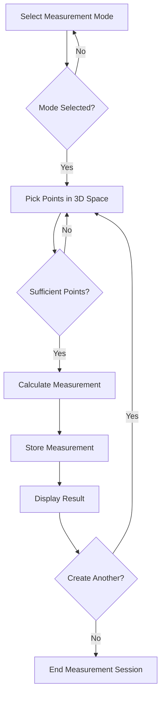
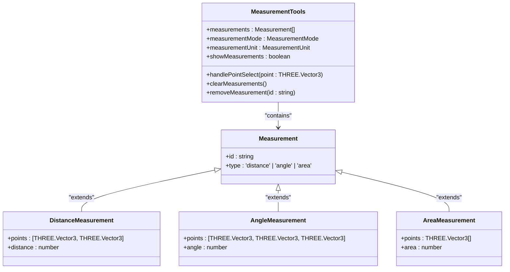
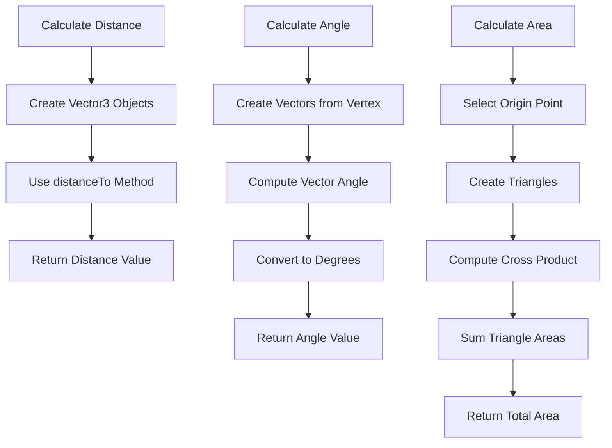

# Measurement Tools

<cite>
**Referenced Files in This Document**   
- [MeasurementTools.tsx](file://src/structural-analysis/advanced-3d/MeasurementTools.tsx)
</cite>

## Table of Contents
1. [Introduction](#introduction)
2. [Core Components](#core-components)
3. [Measurement Workflow](#measurement-workflow)
4. [UI Controls](#ui-controls)
5. [Geometric Calculations](#geometric-calculations)
6. [Measurement Management](#measurement-management)
7. [Usage Examples](#usage-examples)
8. [Troubleshooting Guide](#troubleshooting-guide)

## Introduction
The Measurement Tools component provides comprehensive measurement capabilities within the 3D visualization environment for structural analysis. This toolset enables users to perform precise distance, angle, and area measurements on structural models, supporting critical engineering assessments. The implementation leverages THREE.js for 3D vector operations and React for component state management, creating an intuitive interface for spatial measurements in structural engineering applications.

## Core Components

The MeasurementTools component is implemented as a React functional component that manages measurement state and user interactions. It utilizes TypeScript interfaces to define measurement types and props, ensuring type safety throughout the application. The component maintains state for temporary points during measurement creation and manages the collection of completed measurements through callback functions passed as props. The implementation follows React best practices with useCallback hooks to optimize performance by preventing unnecessary re-renders of event handlers.

**Section sources**
- [MeasurementTools.tsx](file://src/structural-analysis/advanced-3d/MeasurementTools.tsx#L18-L40)

## Measurement Workflow

The measurement workflow follows a structured process that begins with selecting a measurement type and concludes with displaying the calculated result. Users initiate a measurement by selecting the desired measurement mode (distance, angle, or area) from the UI controls. Once a mode is selected, the system enters point selection mode where users can click on the 3D model to pick points in space. The component collects these points as THREE.Vector3 objects and stores them temporarily until sufficient points are gathered for the selected measurement type.

For distance measurements, two points are required to define a line segment. Angle measurements require three points, with the second point serving as the vertex of the angle. Area measurements require three or more points to define a polygon. When the required number of points is reached, the corresponding calculation function is invoked, the measurement is added to the collection, and the temporary points are cleared to allow for new measurements.

**Diagram sources**
- [MeasurementTools.tsx](file://src/structural-analysis/advanced-3d/MeasurementTools.tsx#L103-L151)

## UI Controls

The Measurement Tools interface provides intuitive controls for managing measurement operations. The UI is organized into logical sections that group related functionality, making it easy for users to understand and operate the measurement system.

### Measurement Mode Selection
Users can select from four measurement modes:
- **None**: Disables measurement mode
- **Distance**: Measures linear distance between two points
- **Angle**: Measures the angle between three points
- **Area**: Measures the area of a polygon defined by three or more points

### Unit Selection
The component supports three metric units for measurement display:
- Meters (m)
- Centimeters (cm)
- Millimeters (mm)

### Visibility and Management Controls
Additional controls include:
- **Show Measurements**: Toggle visibility of all measurement annotations
- **Clear All**: Remove all stored measurements
- **Individual Removal**: Delete specific measurements from the list

**Diagram sources**
- [MeasurementTools.tsx](file://src/structural-analysis/advanced-3d/MeasurementTools.tsx#L192-L225)

## Geometric Calculations

The measurement system implements precise geometric calculations using THREE.js vector mathematics. Each measurement type has a dedicated calculation function that processes the collected points and returns the appropriate geometric property.

### Distance Calculation
The distance between two points is calculated using the THREE.Vector3 distanceTo method, which computes the Euclidean distance between the points in 3D space.

### Angle Calculation
Angle measurements are calculated by creating vectors from the vertex to the two outer points, then computing the angle between these vectors using the angleTo method. The result is converted from radians to degrees for user-friendly display.

### Area Calculation
Polygon area is calculated using a triangulation approach, dividing the polygon into triangles that share a common vertex. The area of each triangle is computed using the cross product of its edge vectors, and the total area is the sum of all triangle areas.

**Diagram sources**
- [MeasurementTools.tsx](file://src/structural-analysis/advanced-3d/MeasurementTools.tsx#L57-L87)

## Measurement Management

The component provides robust management of measurement data, allowing users to store, view, and manipulate multiple measurements simultaneously. Completed measurements are stored in a collection that persists until explicitly cleared. Each measurement is assigned a unique identifier and includes metadata about its type and geometric properties.

The UI displays a list of all active measurements with their calculated values formatted according to the selected unit. Users can remove individual measurements through a dedicated delete button or clear all measurements at once using the "Clear All" button. The visibility of measurement annotations in the 3D view can be toggled independently of the measurement data, allowing users to hide annotations while preserving the measurement records.

**Section sources**
- [MeasurementTools.tsx](file://src/structural-analysis/advanced-3d/MeasurementTools.tsx#L227-L324)

## Usage Examples

The Measurement Tools can be applied to various structural analysis scenarios:

### Structural Member Lengths
Users can measure the length of beams, columns, or other structural members by selecting two endpoints. This is particularly useful for verifying dimensions in complex 3D models or checking member lengths after structural modifications.

### Joint Angles
By measuring angles at structural joints, engineers can verify connection geometry, assess load transfer angles, or validate design specifications. The angle measurement tool helps ensure that structural elements meet required angular relationships.

### Surface Areas
The area measurement capability allows users to calculate the surface area of structural elements such as floor slabs, wall panels, or roof sections. This information is valuable for material quantity estimation, load area calculations, or architectural planning.

## Troubleshooting Guide

### Inaccurate Measurements
- Ensure the 3D model is properly scaled
- Verify that points are being selected precisely on the intended locations
- Check that the correct unit system is selected for display
- Confirm that the 3D viewer is not experiencing rendering issues

### Point Selection Errors
- Make sure the measurement mode is properly selected before picking points
- Ensure the 3D interaction system is functioning correctly
- Verify that the point selection raycasting is working properly in the 3D scene
- Check for any UI overlay elements that might interfere with point selection

### Measurement Persistence Problems
- Confirm that the measurement state is being properly managed by the parent component
- Verify that the callback functions for state updates are correctly implemented
- Check for any component re-rendering issues that might clear temporary state
- Ensure that measurement data is not being inadvertently reset by other application logic

**Section sources**
- [MeasurementTools.tsx](file://src/structural-analysis/advanced-3d/MeasurementTools.tsx#L103-L324)