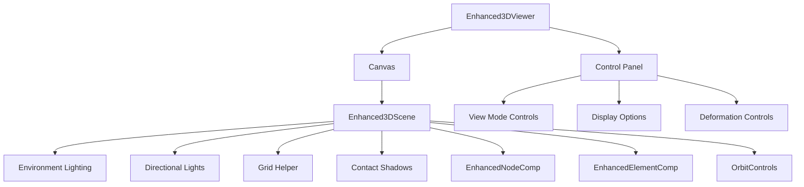
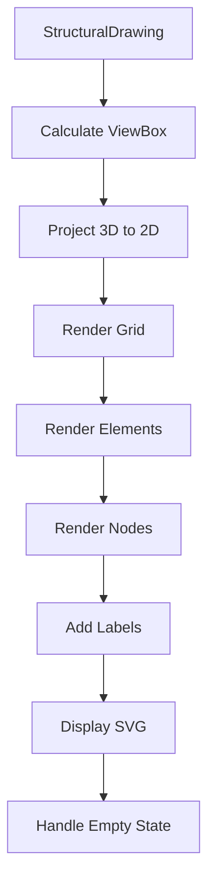
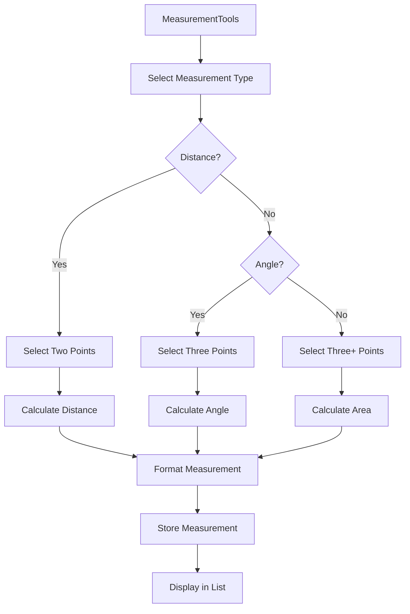
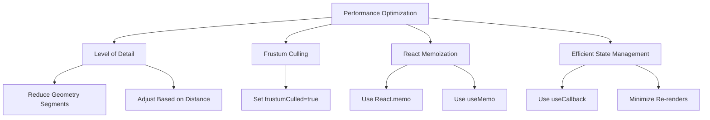
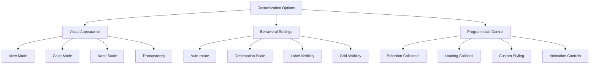
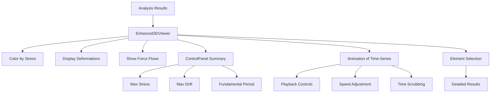

# Visualization System

<cite>
**Referenced Files in This Document**   
- [Structure3DViewer.tsx](file://src/structural-analysis/Structure3DViewer.tsx)
- [StructuralDrawing.tsx](file://src/structural-analysis/drawing/StructuralDrawing.tsx)
- [Enhanced3DViewer.tsx](file://src/structural-analysis/advanced-3d/Enhanced3DViewer.tsx)
- [Enhanced3DScene.tsx](file://src/structural-analysis/advanced-3d/Enhanced3DScene.tsx)
- [Enhanced3DErrorBoundary.tsx](file://src/structural-analysis/common/Enhanced3DErrorBoundary.tsx)
- [MeasurementTools.tsx](file://src/structural-analysis/advanced-3d/MeasurementTools.tsx)
- [AdvancedVisualizationEngine.ts](file://src/structural-analysis/visualization/AdvancedVisualizationEngine.ts)
- [AdvancedVisualizationInterface.tsx](file://src/structural-analysis/visualization/AdvancedVisualizationInterface.tsx)
</cite>

## Table of Contents
1. [3D Visualization System](#3d-visualization-system)
2. [2D Drawing Capabilities](#2d-drawing-capabilities)
3. [Measurement Tools and Annotation Features](#measurement-tools-and-annotation-features)
4. [Performance Optimization Techniques](#performance-optimization-techniques)
5. [Customization of Visualization Appearance and Behavior](#customization-of-visualization-appearance-and-behavior)
6. [Integration with Analysis Results](#integration-with-analysis-results)
7. [Error Boundary Implementation](#error-boundary-implementation)
8. [Common Visualization Workflows](#common-visualization-workflows)
9. [Troubleshooting Rendering Issues](#troubleshooting-rendering-issues)

## 3D Visualization System

The 3D visualization system in APP-STRUKTUR-BLACKBOX is built on React Three Fiber and Three.js, providing an interactive and high-performance environment for visualizing structural models. The system includes two primary components: Structure3DViewer and Enhanced3DViewer, each serving different visualization needs.

The Structure3DViewer component provides a basic SVG-based visualization of structural elements, rendering nodes as circles and elements as lines in a top-down view. This component calculates the viewBox based on the structure's bounds and includes grid lines for reference. It serves as a lightweight visualization option for simple structural representations.

The Enhanced3DViewer component offers advanced 3D visualization capabilities with interactive controls and enhanced rendering features. This component uses React Three Fiber to create a 3D canvas with proper lighting, shadows, and camera controls. The viewer supports multiple view modes (solid, wireframe, both), display options (labels, grid, auto-rotate), and color coding based on material, stress, utilization, or forces. The control panel provides intuitive UI elements for adjusting visualization parameters, including deformation scale sliders and view presets.

The rendering pipeline begins with the Enhanced3DViewer component, which manages the overall visualization state and user interactions. It renders a Canvas component from React Three Fiber, which hosts the Enhanced3DScene component responsible for rendering the actual structural elements. The scene includes environment lighting, directional lights with shadows, and contact shadows for realistic depth perception. The camera is configured with orbit controls that allow users to rotate, pan, and zoom through the 3D space.



**Diagram sources**
- [Enhanced3DViewer.tsx](file://src/structural-analysis/advanced-3d/Enhanced3DViewer.tsx)
- [Enhanced3DScene.tsx](file://src/structural-analysis/advanced-3d/Enhanced3DScene.tsx)

**Section sources**
- [Structure3DViewer.tsx](file://src/structural-analysis/Structure3DViewer.tsx#L9-L173)
- [Enhanced3DViewer.tsx](file://src/structural-analysis/advanced-3d/Enhanced3DViewer.tsx#L534-L718)

## 2D Drawing Capabilities

The 2D drawing capabilities in APP-STRUKTUR-BLACKBOX are implemented in the StructuralDrawing.tsx component, providing plan and elevation views of structural models using SVG rendering. This component creates detailed 2D drawings that complement the 3D visualization by offering traditional engineering views that are familiar to structural engineers.

The StructuralDrawing component renders structural elements as SVG graphics, with nodes displayed as circles and elements as lines. Each node is labeled with its ID, and each element is labeled with its ID as well, providing clear identification of structural components. The component calculates the viewBox based on the structure's bounds with appropriate padding to ensure all elements are visible within the drawing area.

The drawing includes a coordinate grid with dashed lines at regular intervals, providing spatial reference for the structural elements. The grid spacing is dynamically calculated based on the structure's dimensions, ensuring appropriate scale and readability. Element types are differentiated by color: beams are rendered in a light gray-blue (#94a3b8), columns in a medium gray (#64748b), and slabs in a light gray (#9ca3af).

The component handles empty states gracefully, displaying a placeholder message when no structure data is available. This provides clear feedback to users during the design process when structural elements have not yet been defined. The SVG is responsive and maintains proper aspect ratio through the preserveAspectRatio attribute set to "xMidYMid meet".



**Diagram sources**
- [StructuralDrawing.tsx](file://src/structural-analysis/drawing/StructuralDrawing.tsx#L9-L211)

**Section sources**
- [StructuralDrawing.tsx](file://src/structural-analysis/drawing/StructuralDrawing.tsx#L9-L211)

## Measurement Tools and Annotation Features

The measurement tools in APP-STRUKTUR-BLACKBOX provide comprehensive analysis capabilities for structural models, allowing users to perform distance, angle, and area measurements directly within the 3D visualization environment. These tools are implemented in the MeasurementTools.tsx component and integrate seamlessly with the Enhanced3DViewer.

The measurement system supports three primary measurement types: distance, angle, and area. For distance measurements, users select two points in 3D space, and the tool calculates the Euclidean distance between them. Angle measurements require three points (vertex and two endpoints), with the tool calculating the angle between the vectors formed by these points. Area measurements can be performed on any polygonal region by selecting three or more points, with the tool using the shoelace formula to calculate the enclosed area.

Users can select measurement units (meters, centimeters, or millimeters) which are automatically applied to all measurements. The interface includes a visibility toggle to show or hide all measurements, and a clear button to remove all measurements at once. Completed measurements are displayed in a list with their calculated values and include a delete button for individual removal.

The measurement tools use Three.js Vector3 objects to represent 3D coordinates, ensuring accurate calculations in three-dimensional space. The formatMeasurement function converts raw measurement values to human-readable strings with appropriate unit suffixes. The component maintains state for both temporary points (during measurement creation) and completed measurements, providing a smooth user experience.



**Diagram sources**
- [MeasurementTools.tsx](file://src/structural-analysis/advanced-3d/MeasurementTools.tsx#L103-L324)

**Section sources**
- [MeasurementTools.tsx](file://src/structural-analysis/advanced-3d/MeasurementTools.tsx#L103-L324)

## Performance Optimization Techniques

APP-STRUKTUR-BLACKBOX employs several performance optimization techniques to ensure smooth rendering of large structural models, particularly in the 3D visualization components. These optimizations are critical for maintaining interactive frame rates when visualizing complex structures with thousands of elements.

One key optimization is Level of Detail (LOD) implementation, which adjusts the geometric complexity of structural elements based on their distance from the camera and the overall complexity of the structure. For distant or complex structures, the system reduces the number of segments in cylinder geometries from 8 to 4 or 6, significantly reducing the vertex count without noticeably affecting visual quality. This LOD logic considers both camera distance and element count to make intelligent decisions about detail level.

Frustum culling is enabled for all mesh objects, ensuring that elements outside the camera's view frustum are not rendered. This optimization is implemented by setting the frustumCulled property to true on mesh objects, which allows Three.js to skip rendering calculations for objects that are not visible. This dramatically improves performance when viewing large structures from close-up perspectives.

The visualization components use React.memo for memoization of subcomponents like EnhancedNodeComp and EnhancedElementComp, preventing unnecessary re-renders when props have not changed. This optimization reduces the React reconciliation overhead and improves interaction responsiveness. The Enhanced3DScene component also uses useMemo to memoize expensive calculations like bounding box and center point determination.

For large datasets, the system implements virtualization principles by only rendering elements that are within the current view, rather than attempting to render all elements simultaneously. The Enhanced3DViewer component manages state efficiently, using useCallback for event handlers to maintain stable function references across renders.



**Diagram sources**
- [Enhanced3DViewer.tsx](file://src/structural-analysis/advanced-3d/Enhanced3DViewer.tsx#L213-L383)

**Section sources**
- [Enhanced3DViewer.tsx](file://src/structural-analysis/advanced-3d/Enhanced3DViewer.tsx#L213-L383)

## Customization of Visualization Appearance and Behavior

The visualization components in APP-STRUKTUR-BLACKBOX offer extensive customization options for both appearance and behavior, allowing users to tailor the visualization to their specific needs and preferences. These customization features are exposed through component props and interactive controls.

Visual appearance can be customized through multiple parameters including view mode (solid, wireframe, or both), color mode (material, stress, utilization, or forces), and node scale. The color mode determines how structural elements are colored: by material type in normal view, or by analysis results such as stress or utilization ratios. When displaying stress or utilization, a color legend is shown with a gradient from green (low values) to red (high values).

Behavioral customization includes camera controls, animation settings, and display options. Users can enable auto-rotation of the view, control the deformation scale for visualizing structural displacements, and toggle the visibility of labels, grid, and other reference elements. The ControlPanel component provides a user-friendly interface for adjusting these settings with buttons, sliders, and toggles.

The Enhanced3DViewer component accepts several props that allow programmatic control over visualization behavior, including callbacks for element and node selection, loading states, and custom styling. The className and style props enable integration with the application's overall design system. The component also supports animation of time-series data, with controls for playback speed and current time index.

For developers, the component architecture allows for extension and customization through the composition of smaller components like EnhancedNodeComp and EnhancedElementComp. These components can be replaced or enhanced to provide custom visualization styles or behaviors while maintaining compatibility with the overall system.



**Diagram sources**
- [Enhanced3DViewer.tsx](file://src/structural-analysis/advanced-3d/Enhanced3DViewer.tsx#L534-L718)

**Section sources**
- [Enhanced3DViewer.tsx](file://src/structural-analysis/advanced-3d/Enhanced3DViewer.tsx#L534-L718)

## Integration with Analysis Results

The visualization system in APP-STRUKTUR-BLACKBOX is tightly integrated with structural analysis results, allowing users to visualize and interpret the outcomes of structural calculations directly within the 3D and 2D views. This integration is facilitated through the analysisResults prop in the Enhanced3DViewer component and related visualization components.

When analysis results are provided, the visualization system can display stress distributions, deformation patterns, and force flows on the structural model. The colorMode prop determines how analysis results are visualized, with options for stress, utilization, and forces. For stress visualization, elements are colored on a gradient scale from blue (compression) to red (tension), with the intensity corresponding to the magnitude of stress.

The ControlPanel displays a summary of key analysis results including maximum stress, maximum drift, and fundamental period when available. This provides immediate feedback on the structural performance without requiring users to navigate to separate results panels. The info panel in the Enhanced3DViewer also indicates when analysis has been completed by displaying an "Analyzed" badge.

For dynamic analysis, the system supports visualization of time-series data through animation. The Enhanced3DViewer component can animate structural deformations over time, allowing users to observe how the structure responds to dynamic loads. The animation controls include playback, speed adjustment, and time scrubbing, enabling detailed examination of the structural behavior at different time steps.

The integration also supports element selection, where clicking on a structural element displays detailed analysis results for that specific component. This interactive exploration allows engineers to quickly identify critical elements and understand their behavior under load.



**Diagram sources**
- [Enhanced3DViewer.tsx](file://src/structural-analysis/advanced-3d/Enhanced3DViewer.tsx#L534-L718)

**Section sources**
- [Enhanced3DViewer.tsx](file://src/structural-analysis/advanced-3d/Enhanced3DViewer.tsx#L534-L718)

## Error Boundary Implementation

The visualization system in APP-STRUKTUR-BLACKBOX includes a robust error boundary implementation to ensure graceful handling of rendering issues and provide a reliable user experience. The Enhanced3DErrorBoundary component wraps the 3D visualization components and catches any JavaScript errors that occur during rendering.

The error boundary captures detailed error information including the error message, stack trace, component stack, and contextual information about the user's environment. This contextual information includes the browser's user agent, WebGL support status, memory information, and performance metrics, which are invaluable for diagnosing rendering issues.

When an error occurs, the component displays a user-friendly error message explaining that the 3D visualization encountered an error. The message lists potential causes such as invalid structural data, WebGL compatibility issues, memory constraints, or browser graphics limitations. Users are provided with two recovery options: retry the visualization (with a retry counter) or reload the entire page.

The error boundary includes a technical details section that can be expanded to view the full error information, which is helpful for developers and support personnel. The component also implements automatic retry logic, attempting to reinitialize the visualization up to three times before requiring a full page reload.

For error reporting, the component gathers comprehensive context information including WebGL support details (version, renderer, vendor, maximum texture size), memory usage statistics, and performance timing information. This data helps identify whether issues are related to hardware limitations, browser compatibility, or specific structural configurations.

```mermaid
graph TD
    A[Enhanced3DErrorBoundary] --> B{Error Occurred?}
    B -->|No| C[Render Children]
    B -->|Yes| D[Capture Error Details]
    D --> E[Gather Context]
    E --> F[WebGL Support]
    E --> G[Memory Info]
    E