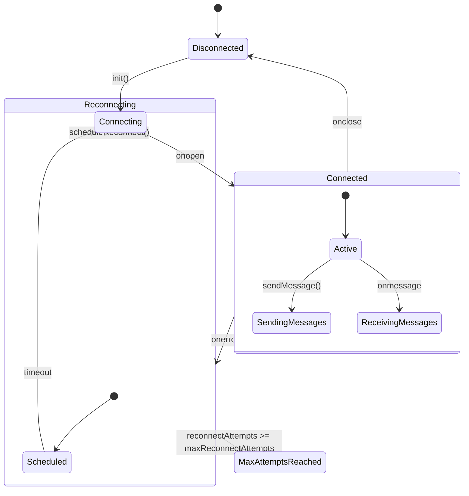
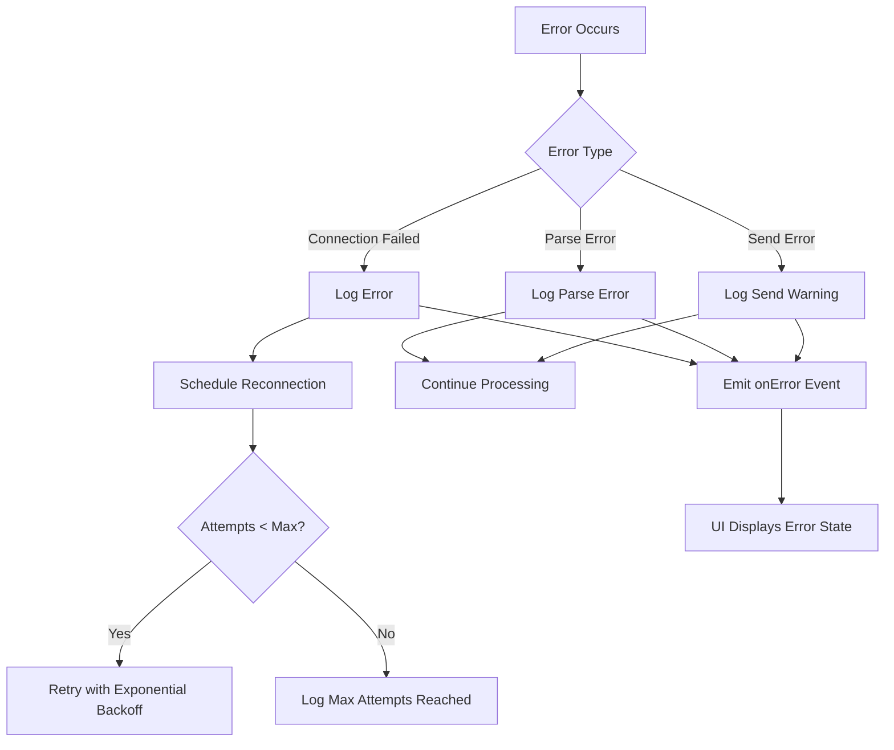
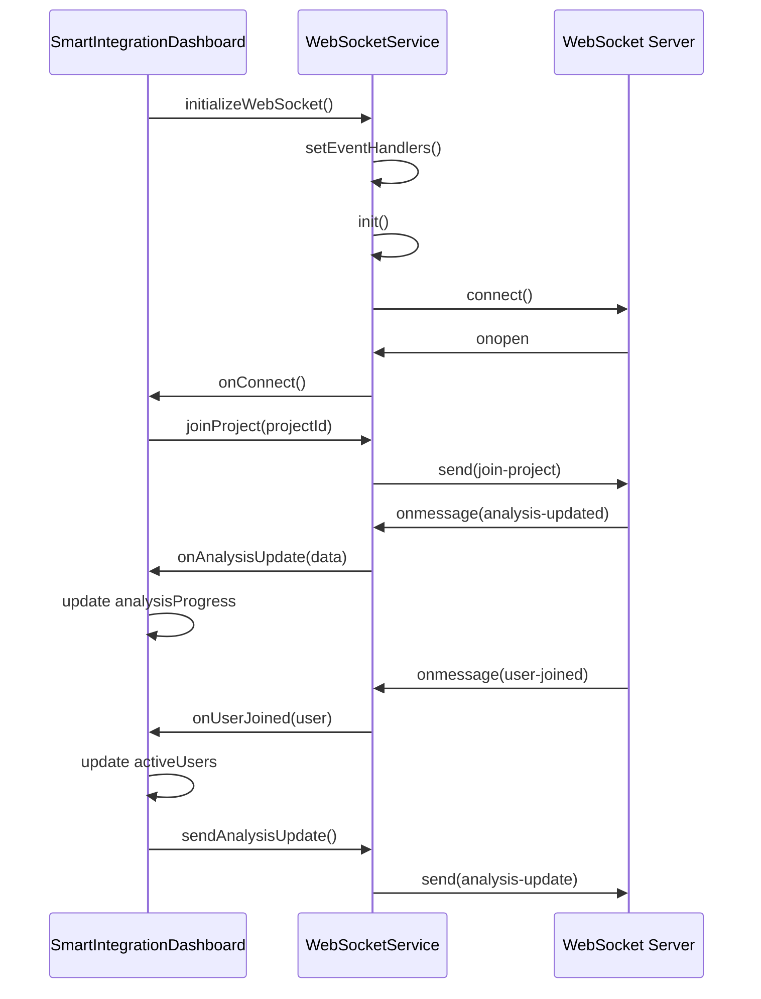

# WebSocket API

<cite>
**Referenced Files in This Document**   
- [webSocketService.ts](file://src/services/webSocketService.ts)
- [SmartIntegrationDashboard.tsx](file://src/components/SmartIntegrationDashboard.tsx)
</cite>

## Table of Contents
1. [Introduction](#introduction)
2. [Architecture Overview](#architecture-overview)
3. [Connection Lifecycle](#connection-lifecycle)
4. [Authentication Mechanism](#authentication-mechanism)
5. [Message Formats](#message-formats)
6. [Error Handling](#error-handling)
7. [Integration with SmartIntegrationDashboard](#integration-with-smartintegrationdashboard)
8. [Real-time Events](#real-time-events)
9. [Presence Tracking](#presence-tracking)
10. [Collaboration Features](#collaboration-features)

## Introduction

The WebSocket API provides real-time communication capabilities for the structural analysis application, enabling collaborative features, live updates, and instant notifications. This documentation details the architecture, connection management, message protocols, and integration points that enable seamless real-time collaboration between users working on structural engineering projects.

The API is implemented as a singleton service that manages the WebSocket connection lifecycle, handles reconnection logic, and provides an event-driven interface for components to subscribe to real-time updates. It integrates tightly with the SmartIntegrationDashboard to provide live collaboration features for structural analysis workflows.

**Section sources**
- [webSocketService.ts](file://src/services/webSocketService.ts#L1-L20)
- [SmartIntegrationDashboard.tsx](file://src/components/SmartIntegrationDashboard.tsx#L1-L50)

## Architecture Overview

The WebSocket API follows a client-server architecture with a singleton service pattern on the client side. The architecture consists of three main components: the WebSocketService class, the event handler interface, and the integration layer with UI components.

```mermaid
classDiagram
class WebSocketService {
-ws : WebSocket | null
-isConnected : boolean
-reconnectAttempts : number
-maxReconnectAttempts : number
-handlers : WebSocketEventHandlers
-reconnectInterval : NodeJS.Timeout | null
+setEventHandlers(handlers : WebSocketEventHandlers) : void
+init() : void
+joinProject(projectId : string) : void
+leaveProject(projectId : string) : void
+sendAnalysisUpdate(projectId : string, analysisData : any) : void
+sendPerformanceData(projectId : string, performanceData : any) : void
+sendNotification(notification : {type, title, message, projectId}) : void
+isSocketConnected() : boolean
+getConnectionStatus() : {connected, reconnectAttempts}
+disconnect() : void
+reconnect() : void
}
class WebSocketEventHandlers {
+onConnect() : void
+onDisconnect() : void
+onAnalysisUpdate(data : any) : void
+onPerformanceUpdate(data : any) : void
+onUserJoined(user : any) : void
+onUserLeft(user : any) : void
+onProjectUpdate(project : any) : void
+onNotification(notification : any) : void
+onError(error : any) : void
}
class RealTimeNotification {
+id : string
+type : 'info' | 'warning' | 'error' | 'success'
+title : string
+message : string
+timestamp : string
+projectId? : string
+userId? : string
}
class CollaborationUser {
+id : string
+name : string
+email : string
+avatar? : string
+status : 'online' | 'away' | 'busy'
+currentProject? : string
}
class RealTimeUpdate {
+type : 'analysis' | 'performance' | 'project' | 'user' | 'notification'
+data : any
+timestamp : string
+userId? : string
+projectId? : string
}
WebSocketService --> WebSocketEventHandlers : "uses"
WebSocketService --> RealTimeNotification : "sends/receives"
WebSocketService --> CollaborationUser : "tracks"
WebSocketService --> RealTimeUpdate : "handles"
```

**Diagram sources**
- [webSocketService.ts](file://src/services/webSocketService.ts#L18-L213)

**Section sources**
- [webSocketService.ts](file://src/services/webSocketService.ts#L1-L246)

## Connection Lifecycle

The WebSocket API manages a complete connection lifecycle with automatic reconnection capabilities. The lifecycle follows a state machine pattern with distinct phases: initialization, connection, disconnection, and reconnection.



The connection process begins when the `init()` method is called, which triggers the `connect()` method to establish a WebSocket connection to the server. The URL is constructed from the `VITE_WS_URL` environment variable, defaulting to `ws://localhost:3001`. The service implements exponential backoff for reconnection attempts, with a maximum of 5 attempts before giving up.

**Section sources**
- [webSocketService.ts](file://src/services/webSocketService.ts#L42-L86)
- [webSocketService.ts](file://src/services/webSocketService.ts#L145-L170)

## Authentication Mechanism

The WebSocket API does not implement a separate authentication mechanism but relies on the underlying application's authentication system. When a client connects to the WebSocket server, the connection URL includes query parameters that likely contain authentication tokens or session identifiers.

The authentication flow is implicit through the connection initialization:

1. The client application authenticates via standard HTTP endpoints
2. Authentication tokens are stored in the application context
3. When initializing the WebSocket connection, the tokens are included in the query string
4. The WebSocket server validates these tokens during the handshake process

This approach ensures that only authenticated users can establish WebSocket connections and participate in real-time collaboration.

**Section sources**
- [webSocketService.ts](file://src/services/webSocketService.ts#L52-L55)

## Message Formats

The WebSocket API uses a standardized message format for all communications between client and server. Messages are JSON objects with a consistent structure that includes a type field and a payload.

### Message Structure
```json
{
  "type": "message-type",
  "payload": { /* message-specific data */ }
}
```

### Supported Message Types

| Message Type | Direction | Payload Structure | Purpose |
|--------------|-----------|-------------------|---------|
| `analysis-update` | Client → Server | `{projectId, ...analysisData, timestamp}` | Send analysis progress updates |
| `analysis-updated` | Server → Client | `{payload: analysisData}` | Receive analysis updates from server |
| `performance-data` | Client → Server | `{projectId, ...performanceData, timestamp}` | Send performance metrics |
| `performance-updated` | Server → Client | `{payload: performanceData}` | Receive performance updates |
| `join-project` | Client → Server | `{projectId}` | Join a project room for collaboration |
| `leave-project` | Client → Server | `{projectId}` | Leave a project room |
| `user-joined` | Server → Client | `{payload: user}` | Notify when a user joins a project |
| `user-left` | Server → Client | `{payload: user}` | Notify when a user leaves a project |
| `project-updated` | Server → Client | `{payload: project}` | Receive project updates |
| `notification` | Server → Client | `{payload: notification}` | Receive system notifications |

**Section sources**
- [webSocketService.ts](file://src/services/webSocketService.ts#L78-L107)
- [webSocketService.ts](file://src/services/webSocketService.ts#L124-L170)

## Error Handling

The WebSocket API implements comprehensive error handling for both connection issues and message processing errors. The error handling strategy includes client-side logging, event emission, and automatic recovery mechanisms.



The service handles several types of errors:
- **Connection errors**: Emitted through the `onerror` event and trigger the reconnection mechanism
- **Message parsing errors**: Occur when received messages cannot be parsed as JSON
- **Send errors**: Occur when attempting to send messages on a disconnected socket

The service implements a maximum of 5 reconnection attempts with exponential backoff, preventing excessive server load during prolonged outages.

**Section sources**
- [webSocketService.ts](file://src/services/webSocketService.ts#L64-L77)
- [webSocketService.ts](file://src/services/webSocketService.ts#L94-L107)

## Integration with SmartIntegrationDashboard

The WebSocket API is tightly integrated with the SmartIntegrationDashboard component, enabling real-time collaboration features for structural analysis projects. The integration follows an event-driven pattern where the dashboard subscribes to WebSocket events and updates its state accordingly.



The dashboard initializes the WebSocket service during component mounting and sets up event handlers for various real-time events. When users run comprehensive analyses, the dashboard sends progress updates through the WebSocket connection, which are then broadcast to other collaborators.

**Diagram sources**
- [webSocketService.ts](file://src/services/webSocketService.ts#L18-L213)
- [SmartIntegrationDashboard.tsx](file://src/components/SmartIntegrationDashboard.tsx#L42-L542)

**Section sources**
- [SmartIntegrationDashboard.tsx](file://src/components/SmartIntegrationDashboard.tsx#L115-L151)
- [SmartIntegrationDashboard.tsx](file://src/components/SmartIntegrationDashboard.tsx#L270-L290)

## Real-time Events

The WebSocket API supports several real-time events that enable collaborative workflows in structural analysis projects. These events are categorized into analysis events, collaboration events, and system events.

### Analysis Events
- **Analysis updates**: Broadcast progress and results of structural analyses
- **Performance updates**: Share computational performance metrics
- **Project updates**: Notify about changes to project data

### Collaboration Events
- **User joined**: Notify when a collaborator joins a project
- **User left**: Notify when a collaborator leaves a project
- **Presence updates**: Track user status and activity

### System Events
- **Notifications**: Deliver system messages and alerts
- **Connection status**: Monitor WebSocket connection health

These events enable multiple users to work on the same structural analysis project simultaneously, with changes and progress updates visible to all collaborators in real time.

**Section sources**
- [webSocketService.ts](file://src/services/webSocketService.ts#L78-L107)
- [SmartIntegrationDashboard.tsx](file://src/components/SmartIntegrationDashboard.tsx#L115-L151)

## Presence Tracking

The WebSocket API implements presence tracking to show which users are currently active in a project. This feature enhances collaboration by providing visibility into team member availability and activity.

Presence tracking works through the following mechanism:
1. When a user joins a project, the client sends a `join-project` message
2. The server broadcasts a `user-joined` event to all other users in the project
3. When a user leaves or their connection closes, a `user-left` event is broadcast
4. The client maintains a list of active users in the project

The presence system includes automatic cleanup when connections are lost, ensuring that the active users list remains accurate even if a user closes their browser or loses network connectivity.

**Section sources**
- [webSocketService.ts](file://src/services/webSocketService.ts#L130-L135)
- [SmartIntegrationDashboard.tsx](file://src/components/SmartIntegrationDashboard.tsx#L135-L145)

## Collaboration Features

The WebSocket API enables several collaboration features that support team-based structural analysis workflows. These features are designed to facilitate real-time teamwork on complex engineering projects.

### Key Collaboration Features

**Real-time Analysis Monitoring**
Multiple team members can monitor the progress of structural analyses in real time. As one engineer runs an analysis, others can see the progress percentage, current task, and intermediate results.

**Simultaneous Project Editing**
Team members can work on different aspects of the same project simultaneously. Changes to project parameters, material specifications, or load cases are immediately visible to all collaborators.

**Instant Notifications**
The system broadcasts notifications about analysis completion, errors, or important events. These notifications appear in the dashboard's real-time updates panel, keeping all team members informed.

**Presence Awareness**
The dashboard displays which team members are currently working on the project, including their status (online, away, busy). This helps coordinate team activities and identify available collaborators.

**Change Tracking**
All significant changes to the project are timestamped and attributed to specific users. This provides an audit trail of modifications and helps understand the evolution of the structural design.

These collaboration features transform the structural analysis workflow from a solitary activity to a team-based process, improving efficiency and enabling knowledge sharing among engineering teams.

**Section sources**
- [SmartIntegrationDashboard.tsx](file://src/components/SmartIntegrationDashboard.tsx#L115-L151)
- [SmartIntegrationDashboard.tsx](file://src/components/SmartIntegrationDashboard.tsx#L400-L450)