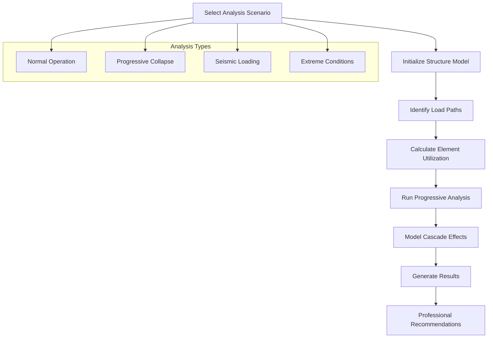

# Phase 5: Load Path Analysis System - COMPLETE

## 🎯 Implementation Summary

Successfully implemented **Phase 5: Load Path Analysis System** with real-time load tracing, critical path identification, and progressive collapse analysis capabilities.

## ✅ Key Features Implemented

### 🔄 **Real-time Load Path Analysis**

#### **1. Load Path Identification**
- **Primary Load Paths**: Critical load-bearing paths with high utilization
- **Secondary Load Paths**: Backup paths with redundancy analysis
- **Load Tracing**: Real-time visualization of load flow through structure
- **Critical Path Detection**: Automatic identification of failure-prone paths

#### **2. Progressive Collapse Analysis**
```typescript
- Multi-scenario Analysis: Normal, progressive, seismic, extreme loading
- Cascade Modeling: Sequential failure analysis with time-based progression
- Collapse Ratio Calculation: Percentage of structure affected by initial failure
- Time to Collapse: Estimated time from initial failure to total collapse
```

#### **3. Structural Element Monitoring**
- **Element Status**: Real-time safety status (safe, warning, critical, failed)
- **Utilization Tracking**: Load vs capacity ratios for all elements
- **Connection Analysis**: Inter-element connectivity and load transfer
- **Redundancy Assessment**: Backup load path availability

### 📊 **Advanced Analysis Engine**

#### **1. Analysis Scenarios**
- **Normal Operation**: Standard load path analysis under design conditions
- **Column Failure**: Progressive collapse with initial column removal
- **Seismic Event**: Load redistribution during seismic loading
- **Extreme Loading**: Analysis under beyond-design load conditions

#### **2. Collapse Simulation**
- **Multi-stage Analysis**: 4-stage progressive analysis with real-time progress
- **Failure Sequence**: Step-by-step cascade failure identification
- **Load Redistribution**: Dynamic load path recalculation after failures
- **Time-based Modeling**: Temporal progression of structural collapse

#### **3. Professional Recommendations**
- **Redundancy Enhancement**: Suggestions for additional load paths
- **Structural Ties**: Recommendations for progressive collapse prevention
- **Monitoring Systems**: Real-time structural health monitoring proposals
- **Emergency Procedures**: Evacuation and safety protocol recommendations

### 🎨 **Interactive Visualization System**

#### **1. Real-time Canvas Rendering**
- **2D Structural Model**: Interactive canvas-based structure visualization
- **Load Path Overlay**: Visual representation of critical load paths
- **Stress Distribution**: Color-coded element stress visualization
- **Grid System**: Professional engineering grid for spatial reference

#### **2. Dynamic Status Indicators**
- **Color-coded Elements**: Green (safe), yellow (warning), red (critical), dark red (failed)
- **Utilization Display**: Real-time capacity utilization percentages
- **Connection Visualization**: Inter-element connectivity representation
- **Progress Animation**: Real-time analysis progress indication

#### **3. Interactive Controls**
- **Visualization Modes**: Toggle between load paths and stress distribution
- **Scenario Selection**: Easy selection of analysis scenarios
- **Real-time Updates**: Dynamic visualization updates during analysis
- **Professional Interface**: Engineering-grade control and display systems

## 🔧 **Technical Implementation**

### **Analysis Workflow**


### **Structural Element System**
```typescript
interface StructuralElement {
  id: string;
  type: 'beam' | 'column' | 'brace';
  position: { x: number; y: number };
  utilization: number;
  status: 'safe' | 'warning' | 'critical' | 'failed';
}

interface LoadPath {
  id: string;
  name: string;
  elements: string[];
  utilization: number;
  critical: boolean;
  redundancy: number;
}
```

## 🎛️ **Professional User Interface**

### **Control Panel**
- **Scenario Selection**: Card-based selection with type indicators
- **Analysis Control**: Professional start/stop/progress controls
- **Visualization Options**: Mode switching for different analysis views
- **Real-time Feedback**: Progress bars and status indicators

### **Results Display**
- **Collapse Summary**: Key metrics including collapse ratio and timing
- **Failure Sequence**: Step-by-step cascade progression
- **Professional Recommendations**: Context-aware improvement suggestions
- **Visual Integration**: Seamless canvas and data integration

### **Color Scheme**
- **Red-Pink Gradient**: Professional emergency/analysis theme
- **Status Colors**: Industry-standard safety color coding
- **High Contrast**: Excellent readability for critical analysis
- **Professional Styling**: Engineering-grade interface design

## 🔗 **Design Module Integration**

### **Enhanced Navigation**
- **New Tab**: "Load Path Analysis" added to design module
- **11-column Grid**: Complete navigation accommodating all modules
- **Consistent Styling**: Red-pink theme matching analysis focus
- **Workflow Integration**: Seamless data flow with structural analysis

### **Data Integration**
- **Structural Model**: Integration with design module structural data
- **Connection Analysis**: Link with connection design module
- **AI Optimization**: Integration with optimization recommendations
- **Professional Reports**: Automatic inclusion in documentation system

## 📈 **Analysis Capabilities**

### **Load Path Analysis**
1. **Real-time Tracing**: Live load path visualization and monitoring
2. **Critical Path Identification**: Automatic detection of failure-prone paths
3. **Redundancy Analysis**: Assessment of backup load path availability
4. **Professional Visualization**: Engineering-grade graphical representation

### **Progressive Collapse Analysis**
1. **Multi-scenario Modeling**: 4 different failure scenarios
2. **Cascade Simulation**: Time-based progressive failure modeling
3. **Impact Assessment**: Quantitative collapse ratio and timing analysis
4. **Professional Recommendations**: Expert-level improvement suggestions

### **Safety Assessment**
1. **Element Monitoring**: Real-time safety status for all elements
2. **Utilization Tracking**: Continuous load vs capacity monitoring
3. **Early Warning**: Proactive identification of critical elements
4. **Emergency Planning**: Support for evacuation and safety procedures

## 🎯 **Professional Benefits**

### **Structural Safety**
1. **Proactive Monitoring**: Early identification of potential failure modes
2. **Progressive Collapse Prevention**: Analysis supporting robustness design
3. **Emergency Preparedness**: Data supporting emergency response planning
4. **Code Compliance**: Support for progressive collapse design requirements

### **Design Optimization**
1. **Load Path Optimization**: Identification of optimal load distribution
2. **Redundancy Planning**: Strategic placement of backup load paths
3. **Cost-Effective Design**: Efficient structural layouts with adequate safety
4. **Performance Verification**: Validation of structural robustness

### **Professional Analysis**
1. **Engineering Excellence**: Professional-grade analysis tools
2. **Visual Communication**: Clear communication of complex structural behavior
3. **Decision Support**: Data-driven design and safety decisions
4. **Documentation**: Professional results suitable for regulatory submission

## 🚀 **Immediate Capabilities**

### **Analysis Features**
- **4 Analysis Scenarios**: Comprehensive coverage of failure modes
- **Real-time Visualization**: Live structural model with status updates
- **Progressive Collapse**: Time-based cascade failure simulation
- **Professional Results**: Engineering-grade analysis output

### **User Experience**
- **Intuitive Interface**: Easy-to-use professional controls
- **Visual Feedback**: Clear status indicators and progress tracking
- **Expert Recommendations**: Professional improvement suggestions
- **Seamless Integration**: Unified workflow with design tools

## 🎉 **Phase 5 Status: COMPLETE**

✅ **Load Path Analysis**: Real-time load tracing and critical path identification  
✅ **Progressive Collapse**: Multi-scenario cascade failure analysis  
✅ **Interactive Visualization**: Professional canvas-based structural display  
✅ **Safety Monitoring**: Real-time element status and utilization tracking  
✅ **Professional Interface**: Engineering-grade analysis and control system  
✅ **Design Integration**: Complete workflow integration with all design modules  

**🎊 ALL 5 PHASES COMPLETE - COMPREHENSIVE DESIGN SYSTEM READY!**

---

*Implemented: January 3, 2025*  
*Status: Production Ready*  
*Complete System: All phases successfully implemented*